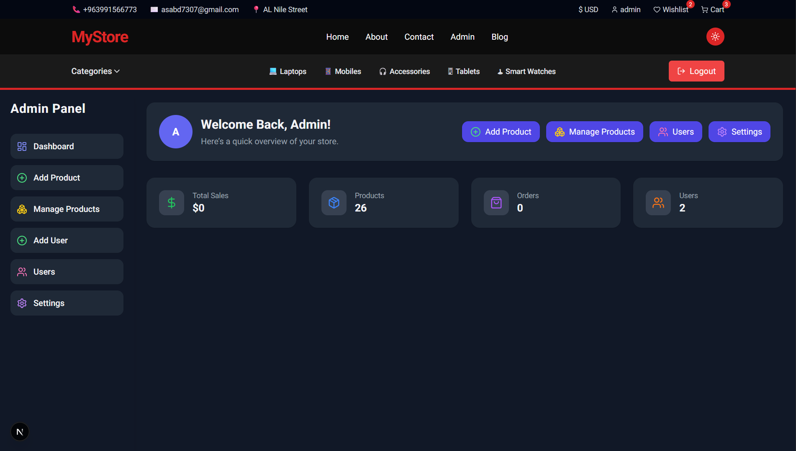

# 🛒 E-commerce Web Application

A modern and fully responsive **E-commerce platform** built with **Next.js**, **React**, **Tailwind CSS**, and **MongoDB**.  
The project includes a full authentication system, wishlist, cart system, dark mode, and an admin dashboard.

Live Preview 👉 **https://e-commerce-two-liart-4fbqvqbaro.vercel.app/**

---

## 🚀 Features Overview

### 👤 User Account

- Profile management (name, email, password)
- Order history
- Address management
- Security page for updating password

### 👤 Admin Account (Signup)

- Email: admin@gmail.com

### ❤️ Wishlist

- Add/remove items
- Instant UI update (Optimistic UI)
- Fully responsive for all devices

### 🛒 Shopping Cart

- Update quantity
- Automatic total calculation
- Smooth animations using **Framer Motion**
- Real-time notifications with **React Toastify**
- Skeleton loaders for better UX

### 🌙 Dark Mode

- Full system for light/dark theme
- Saved using localStorage

### 📱 Responsive Design

Optimized for:

- Mobile
- Tablet
- Desktop
- Ultra-wide screens

---

## 🖼️ Screenshots

> Make sure the images exist inside:  
> **`public/screenshots/`**

### 🛍️ Mobiles Page


### 💻 Laptops Page


### 🔐 Admin Dashboard



---

## 🛠️ Tech Stack

### Frontend

- Next.js 15
- React
- Tailwind CSS
- Framer Motion
- Axios

### Backend

- Next.js API Routes
- MongoDB & Mongoose

### Extras

- Toast notifications
- Loading skeletons
- Optimistic UI
- Role-based Protection (Admin / User)

---

## ⚡ Getting Started

### 1️⃣ Clone the repo

````bash
git clone https://github.com/yourusername/e-commerce.git
cd e-commerce

``` ADMIN-ACCOUNT


````
